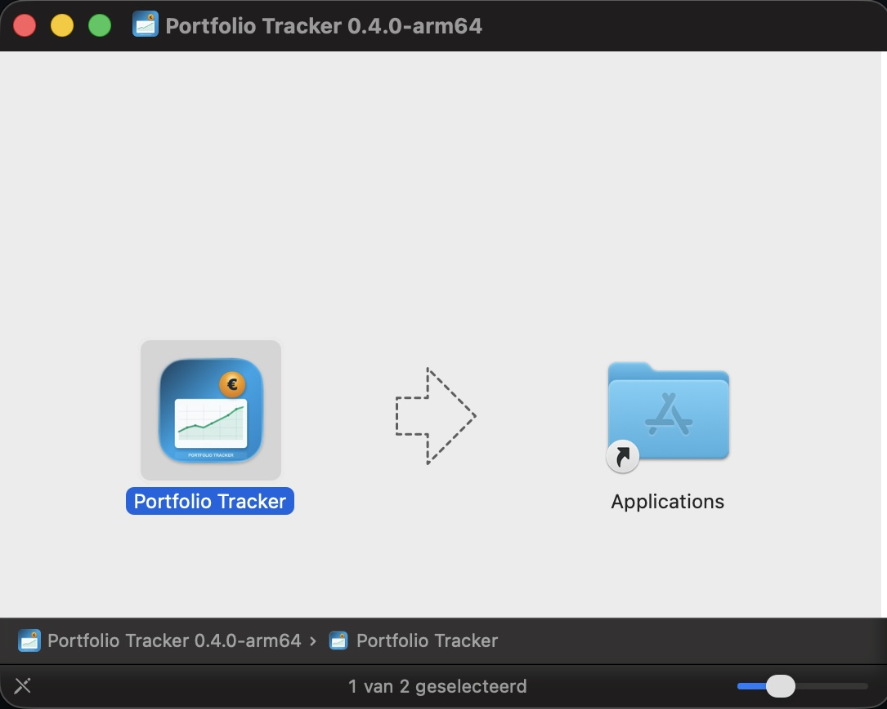
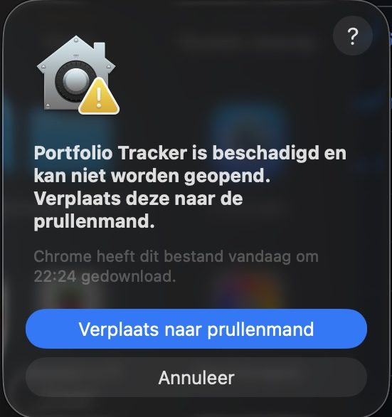
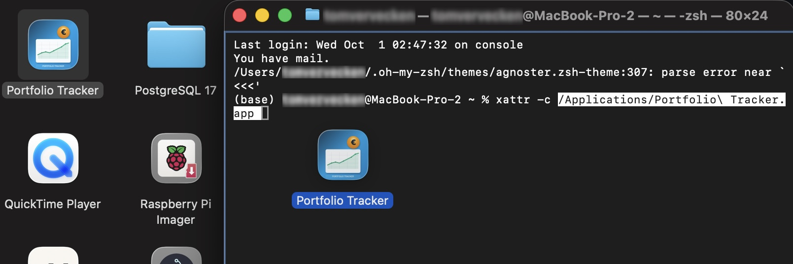

# Portfolio Tracker

A desktop application for tracking and analyzing stock options portfolios. Built with Electron for monitoring employee stock option plans.

**Version 0.4.2** | **Build Date**: October 10, 2025 | **Status**: Beta | **License**: MIT

## Important Disclaimer

**Portfolio Tracker is a TRACKING TOOL ONLY** - it does not execute any financial transactions.

- 📊 For Tracking Only - Monitor and analyze your portfolio performance
- 🚫 No Trading - Cannot buy, sell, or execute any transactions
- 💼 Official Platform Required - All sales must be done through your official brokerage
- ⚖️ No Financial Advice - This tool does not provide investment advice

**Always use your official stock option platform for actual transactions.**

## Installation

### Windows (Portable - No Installation Required)

1. Download `Portfolio Tracker 0.4.2.exe` from [Releases](../../releases)
2. Double-click to run - works from anywhere (Desktop, USB stick, network drive)
3. Your data stays local in `portfolio.db` file next to the .exe

**Features**: Fully self-contained • Local data storage • Privacy first • No admin rights needed • Optional internet (only for price updates)

### macOS Installation & Fix (64-bit / x64)

**IMPORTANT FOR MAC USERS**: macOS may block the app with a "damaged file" warning. The macOS version is 64-bit (x64). Follow these steps:



**Step 1**: Drag Portfolio Tracker to Applications folder



**Step 2**: macOS shows "damaged file" warning - Click **Cancel** (do NOT delete!)



**Step 3**: Open Terminal and run:
```bash
xattr -c /Applications/Portfolio\ Tracker.app
```
Or drag the app from Applications into Terminal after typing `xattr -c ` (with space at end), then press Enter.

**The app will now work!** This is a one-time fix required for unsigned macOS apps.

## Features

### Portfolio Management
- **Dual-Source Support**: Track both KBC and ING employee stock option grants *(New in v0.3.9)*
- **Real-time Tracking**: Monitor total portfolio value, active options, and performance metrics
- **Grant Management**: Track grants with exercise prices, quantities, and vesting schedules
- **ING Integration**: Add ING grants using ISIN (FOP number) with automatic price fetching *(New in v0.3.9)*

### Evolution Analysis
- **Period-based Analysis**: View changes over 30 days, 90 days, 1 year, or all time
- **Profit/Loss Calculation**: Real-time gains/losses with percentage changes
- **Historical Tracking**: Evolution data with snapshot comparisons
- **Visual Indicators**: Color-coded gains (green) and losses (red)

### Financial Tools
- **Smart Price Updates**: Once-per-day price updates after 09:00 Belgian time *(Enhanced in v0.4.1)*
  - NTP-based time verification (industry standard, tamper-resistant)
  - Automatic timezone and DST handling
  - Smart scheduling with auto-enable
  - Significantly faster updates with KBC CSV caching
  - 16% faster ING price fetching
- **Platform-Specific Links**: Sell modal shows correct trading platform *(New in v0.4.1)*
  - ING grants: Direct link to ING MyLeo platform
  - KBC grants: Direct link to KBC ESOP platform
- **Tax Calculations**: Automated tax calculations with customizable rates
- **Currency Support**: Multi-currency display with Euro (€) primary
- **Sales Tracking**: Complete sales history with profit/loss
- **Target Monitoring**: Track progress against portfolio targets

### Historical Price Management *(v0.3.0)*
- **Automatic Historical Prices**: Fetches real grant date prices when adding grants
- **Smart Price Derivation**: Derives prices from next available trading day when needed
- **Bulk Updates**: Update historical prices for entire portfolio with progress tracking
- **Portfolio Recalculation**: Automatically rebuilds evolution timeline

⚠️ **Performance Note**: Historical updates can take several minutes for large portfolios.

## What's New in v0.4.1

### New Features
- **Belgian Time-Based Updates**: Price updates now enforced after 09:00 Belgian time
  - Uses external time API (no local clock dependency)
  - Automatic DST handling
  - Smart scheduling: auto-enables update button when time reached
  - One update per day enforcement
  - Works even if app starts before 09:00

See [CHANGELOG.md](CHANGELOG.md) for complete version history.

## Quick Start

1. **Launch**: Double-click `Portfolio Tracker 0.4.2.exe`
2. **First Run**: App creates `portfolio.db` file
3. **Add Grant**:
   - Click "➕ Add Grants"
   - Select source (KBC or ING)
   - For ING: Enter ISIN from your option plan documents
   - For KBC: Enter grant date and exercise price
4. **Track**: Navigate tabs to view portfolio performance
5. **Execute Sales**: Use your official brokerage platform

### File Management
- **Database**: `portfolio.db` - Contains all your portfolio data
- **Backup**: Copy both `.exe` and `.db` files
- **Privacy**: Your data never leaves your computer (except price updates)

## Data Storage & Privacy

### Complete Privacy
- 🔒 Local Data Storage - All data stored on your machine
- 🚫 No Data Transmission - Portfolio data never transmitted
- 🏠 Local Database - SQLite `portfolio.db` file
- 👤 Full Control - You own all your data

### Internet Connection
- 📈 Price Updates - Internet required only for fetching current stock prices
- 🔄 Optional - App works offline with existing data
- 🔒 Secure - Only fetches publicly available stock price information

### Portability
- 📁 Run Anywhere - Desktop, USB stick, network drive
- 💼 Business Use - Works in corporate environments
- 🔄 Easy Backup - Just copy .exe and .db files

## Troubleshooting

### Windows Issues
**Portable .exe won't start**:
- Run from writable location (not Program Files)
- Check Windows Defender/antivirus isn't blocking
- Ensure sufficient disk space (100MB+)
- Try Desktop or Documents folder

**Database errors**:
- Ensure folder containing .exe is writable
- Check `portfolio.db` isn't opened by another program
- Verify antivirus isn't blocking database creation

### macOS Issues
**"Damaged file" warning**:
- See installation instructions above
- Run `xattr -c` command in Terminal
- This is required for unsigned apps on macOS

**Performance issues**:
- Close other applications to free memory
- Reduce chart data range for large datasets
- Run from local drive instead of network drive

### Support
For issues and feature requests:
1. Check troubleshooting section above
2. Review existing issues in repository
3. Create new issue with detailed information

## Technical Details

**Built With**: Electron, SQLite, Chart.js, HTML/CSS/JavaScript

**Requirements**:
- Windows 10+ or macOS 10.13+
- 512MB RAM minimum
- 150MB disk space

For developer documentation, see [DEVELOPER.md](DEVELOPER.md)

## Changelog

See [CHANGELOG.md](CHANGELOG.md) for detailed version history.

## License

MIT License - see [LICENSE](LICENSE) file for details.

## Acknowledgments

- Built with [Electron](https://www.electronjs.org/)
- Charts powered by [Chart.js](https://www.chartjs.org/)
- Database by [SQLite](https://www.sqlite.org/)

**Special thanks to [@TomGun87](https://github.com/TomGun87)** for heavy lifting on ING implementation and core architecture.

---

**Portfolio Tracker v0.4.2** - Professional stock options portfolio management with dual-source support (KBC and ING).
