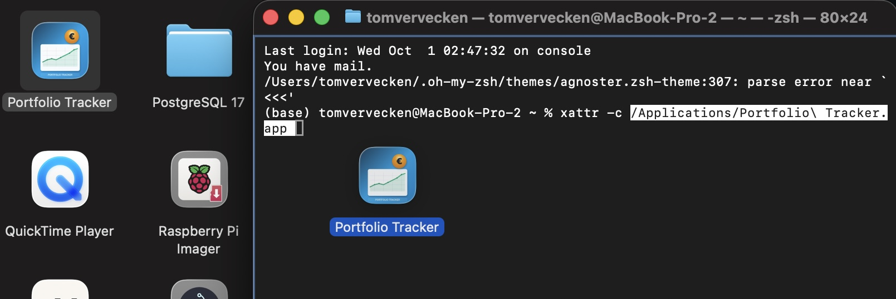

****# Portfolio Tracker

A comprehensive desktop application for **tracking and analyzing** stock options portfolios, built with Electron and designed for monitoring employee stock option plans and investment performance. **This is a tracking tool only - all transactions must be executed through your official brokerage platform.**


## Version 0.3.9

**Status**: Beta Version
**Build Date**: October 5, 2025
**License**: MIT  

## ⚠️ Important Disclaimer

**Portfolio Tracker is a TRACKING TOOL ONLY** - it does not execute any financial transactions.

- **📊 For Tracking Only**: Monitor and analyze your portfolio performance
- **🚫 No Trading**: Cannot buy, sell, or execute any transactions
- **💼 Official Platform Required**: All sales and transactions must be done through your official brokerage/stock option platform
- **📈 Analysis Tool**: Provides insights and calculations for informed decision-making
- **⚖️ No Financial Advice**: This tool does not provide investment or financial advice

**Always use your official stock option platform for actual transactions and consult with financial advisors for investment decisions.**

## Features

### 📊 Portfolio Management
- **Dual-Source Support**: Track both KBC and ING employee stock option grants in one portfolio *(New in v0.3.9)*
- **Real-time Portfolio Tracking**: Monitor your total portfolio value, active options, and performance metrics
- **Grant Management**: Track stock option grants with exercise prices, quantities, and vesting schedules
- **Performance Analytics**: View portfolio evolution over time with interactive charts and graphs
- **ING Integration**: Add ING grants using ISIN (FOP number) with automatic price fetching *(New in v0.3.9)*

### 📈 Evolution Analysis
- **Period-based Analysis**: View portfolio changes over 30 days, 90 days, 1 year, or all time
- **Profit/Loss Calculation**: Real-time calculation of gains/losses with percentage changes
- **Historical Tracking**: Comprehensive evolution data with snapshot comparisons
- **Visual Indicators**: Color-coded gains (green) and losses (red) for quick reference

### 🔍 Data Visualization
- **Interactive Charts**: Multiple chart types for portfolio analysis
- **Time-series Data**: Historical performance tracking with detailed timelines
- **Filtering Options**: Flexible date range selections for focused analysis
- **Export Capabilities**: Export data for external analysis

### 💰 Financial Tools
- **Tax Calculations**: Automated tax amount calculations with customizable rates
- **Currency Support**: Multi-currency display with Euro (€) as primary currency
- **Sales Tracking**: Complete sales history with profit/loss calculations
- **Target Monitoring**: Track progress against portfolio targets

### 🕐 Historical Price Management *(New in v0.3.0)*
- **Automatic Historical Price Fetching**: Fetches real grant date prices when adding new grants
- **Smart Price Derivation**: When exact grant date prices are unavailable, derives accurate prices from next available trading day
- **Bulk Historical Updates**: Update historical prices for entire portfolio with progress tracking
- **Data Quality Handling**: Intelligently rounds derived prices to nearest 10 for consistency
- **Visual Progress Feedback**: Real-time progress bars during historical data processing
- **Portfolio Recalculation**: Automatically rebuilds evolution timeline with historical data

⚠️ **Performance Note**: Historical price updates can take significant time depending on portfolio size. Large portfolios with many grant dates may require several minutes to complete the full historical data rebuild.

## Installation

### 🚀 Standalone Portable Version (Recommended)

**No installation required!** Download and run the portable executable:

1. **Download**: Get the latest `Portfolio Tracker 0.3.9.exe` from the [Releases](../../releases) page
2. **Run**: Double-click the .exe file to start the application
3. **Portable**: No installation needed - run from anywhere (Desktop, USB stick, network drive)

### 🆕 New in Version 0.3.9
- **ING Grant Support**: Full support for ING employee stock option plans alongside KBC
- **Improved UX**: Cleaner grant addition form with hidden fields until source selection
- **Accurate Pricing**: ING grants use actual first available prices (no artificial rounding)
- **Performance**: Price updates only process active/partially sold grants
- **Windows Fix**: Resolved app exit issues on Windows platform

### ⚠️ Important for Users Upgrading from Older Versions
**If upgrading from version 0.3.1 or earlier, please run Settings → Update Historical Prices** to ensure your portfolio evolution calculations are using the latest optimized data processing. This will rebuild your portfolio timeline with the new performance enhancements and ensure all historical data is properly synchronized.

#### ✨ Portable Features
- **🗂️ Fully Self-Contained**: All dependencies bundled in single .exe file
- **💾 Local Data Storage**: Database stored next to .exe file - your data stays local
- **🔒 Privacy First**: Your portfolio data never leaves your computer
- **📁 Run Anywhere**: Desktop, Documents, USB stick, network drive - your choice
- **⚡ Instant Start**: No installation, no admin rights needed
- **🌐 Optional Internet**: Only needed for fetching current stock prices

### Mac only


*First install by dragging to Applications folder.*


*Mac os might complain that file is damaged and should be deleted. Click cancel!*



*Open up Terminal and type in following command:<br />
xattr -c [Directory-of-Installation/Portfolio Tracker.app]<br />
You can enter the [Directory-of-Installation/Portfolio Tracker.app] yourself or just drag the Portfolio Tracker from the installation folder (Applications by default) to the Terminal window and press enter.<br/>
App should now be working!*

### 🛠️ Development Setup (For Developers)

Only needed if you want to modify the application:

#### Prerequisites
- **Node.js**: Version 18.0.0 or higher
- **npm**: Version 8.0.0 or higher
- **Operating System**: Windows, macOS, or Linux

#### Setup Steps

1. **Clone the repository**:
   ```bash
   git clone https://github.com/rikvdb229/OTC_PORTFOLIO_APP.git
   cd OTC_PORTFOLIO_APP
   ```

2. **Install dependencies**:
   ```bash
   npm install
   ```

3. **Start development version**:
   ```bash
   npm start
   ```

#### Build for Distribution

```bash
# Build portable .exe for Windows
npm run build

# Build for all platforms (development)
npm run build:all
```

## 💾 Data Storage & Privacy

### Local Database Storage
- **Location**: `portfolio.db` file created next to the .exe
- **Format**: SQLite database (industry standard)
- **Size**: Typically under 1MB for normal usage
- **Backup**: Manual backup by copying the .db file

### Complete Privacy
- **🔒 Local Data Storage**: All portfolio data stored locally on your machine
- **🚫 No Data Transmission**: Your personal portfolio data never leaves your computer
- **🏠 Local Database**: Database stored locally in `portfolio.db` file
- **👤 Full Control**: You own and control all your portfolio data
- **🔐 Privacy First**: No cloud storage or external data collection for your portfolio

### Internet Connection
- **📈 Price Updates**: Internet connection required to fetch current stock prices from online platforms
- **🔄 Optional Updates**: Price fetching can be disabled - app works offline with existing data
- **⚡ Quick Fetches**: Only fetches price data when you request updates
- **🔒 Secure**: Only connects to fetch publicly available stock price information

### Portability
- **📁 Run from anywhere**: Desktop, USB stick, network drive
- **💼 Business Use**: Works in corporate environments (requires internet for price updates)
- **🏃‍♂️ Mobile**: Take your portfolio data with you on USB stick
- **🔄 Easy Backup**: Just copy the .exe and .db files

## Usage

### Getting Started

**Remember: This app is for tracking only. Use your official platform for actual transactions.**

1. **Launch the Application**: Double-click `Portfolio Tracker 0.3.9.exe`
2. **First Run**: The app creates a `portfolio.db` file next to the .exe
3. **Add Your First Grant**:
   - Click "➕ Add Grants"
   - Select grant source (KBC or ING)
   - For ING grants: Enter ISIN (FOP number) from your ING option plan documents
   - For KBC grants: Enter grant date and select exercise price
4. **Track Performance**: Navigate between tabs to view different aspects of your portfolio
5. **Monitor Evolution**: Use the Evolution tab to see how your portfolio changes over time
6. **Execute Transactions**: Use your official brokerage/stock option platform for actual sales

### 📁 File Management
- **Database**: `portfolio.db` - Contains all your portfolio data
- **Backup**: Copy both `.exe` and `.db` files to backup location
- **Move**: Copy both files to new location and run from there
- **Share**: Never share the `.db` file (contains your private financial data)

### Navigation

- **Portfolio Tab**: Overview of current holdings and total values
- **Evolution Tab**: Historical performance and time-based analysis
- **Chart Tab**: Visual representations of portfolio data
- **Sales History**: Record and track completed transactions
- **Grant History**: Manage and monitor stock option grants

### Key Functions

#### Portfolio Overview
- View total portfolio value and option counts
- Monitor target achievement and return percentages
- Track latest price updates and changes

#### Evolution Analysis
- Select time periods: 30 days, 90 days, 1 year, or all time
- View profit/loss calculations: "Change since [date]: [amount] ([percentage])"
- Real-time updates when switching between periods

#### Grant Management
- Add new grants with exercise prices and quantities
- Track vesting schedules and sellable quantities
- Monitor status changes (Active, Partially Sold, Sold)
- Automatic historical price fetching for accurate grant date valuations

#### Historical Price Management *(New in v0.3.0)*
- **Settings → Update Historical Prices**: Rebuild historical data for entire portfolio
- **Automatic Price Derivation**: System intelligently derives missing grant date prices
- **Progress Tracking**: Visual feedback during historical data processing phases:
  1. **Fetching Phase**: Downloads historical prices from external sources
  2. **Processing Phase**: Rebuilds portfolio evolution timeline with new data
- **Time Requirements**: Processing time varies by portfolio size:
  - Small portfolios (1-5 grants): 30 seconds - 2 minutes
  - Medium portfolios (6-15 grants): 2-5 minutes  
  - Large portfolios (15+ grants): 5-15 minutes
- **Internet Required**: Historical price fetching requires active internet connection
- **Data Quality**: System handles missing data points by deriving from nearest available prices

## Configuration

### Database
- **Type**: SQLite (local file storage)
- **Location**: `portfolio.db` in application directory
- **Backup**: Automatic backup creation and restoration

### Settings
- **Target Percentage**: Customizable portfolio target (default: 65%)
- **Tax Rate**: Automatic tax calculation rate (default: 30%)
- **Currency Symbol**: Display currency (default: €)
- **Auto Price Updates**: Enable/disable automatic price refreshing

## Technical Architecture

### Built With
- **[Electron](https://www.electronjs.org/)**: Desktop application framework
- **[SQLite](https://www.sqlite.org/)**: Local database storage
- **[Chart.js](https://www.chartjs.org/)**: Interactive charts and visualizations
- **HTML/CSS/JavaScript**: Frontend interface and interactions

### Project Structure
```
portfolio-tracker/
├── main.js              # Electron main process
├── renderer.js          # Main renderer process
├── portfolio-db.js      # Database operations
├── scraper.js           # Data scraping utilities
├── index.html           # Main application UI
├── styles/              # CSS stylesheets
├── utils/               # Utility modules
├── ui/                  # UI component generators
├── libs/                # Third-party libraries
└── assets/              # Icons and images
```

### Key Modules
- **DataLoader**: Handles data loading and evolution calculations
- **StatsManager**: Portfolio statistics and performance metrics
- **UIStateManager**: Application state and interface management
- **IPCCommunication**: Inter-process communication handling
- **PortfolioCalculations**: Business logic for portfolio calculations

## Development

### Requirements
- Node.js 18+
- Electron 33+
- Modern web browser for testing

### Development Commands
```bash
# Start in development mode
npm run dev

# Run with debugging
npm start --dev

# Install dependencies
npm install

# Clean build
npm run clean && npm install
```

### Contributing
1. Fork the repository
2. Create a feature branch (`git checkout -b feature/amazing-feature`)
3. Commit your changes (`git commit -m 'Add amazing feature'`)
4. Push to the branch (`git push origin feature/amazing-feature`)
5. Open a Pull Request

### Code Style
- Follow existing code formatting
- Use meaningful variable and function names
- Add comments for complex business logic
- Maintain consistent file organization

## Troubleshooting

### Common Issues

**Portable .exe won't start**:
- Run from a writable location (not Program Files)
- Check Windows Defender/antivirus isn't blocking the file
- Ensure you have sufficient disk space (100MB+ recommended)
- Try running from Desktop or Documents folder

**Database errors**:
- Ensure the folder containing the .exe is writable
- Check that `portfolio.db` file isn't opened by another program
- Verify antivirus isn't blocking database file creation
- Try running from a different location (Desktop, Documents)

**Performance issues**:
- Close other applications to free up memory
- Reduce chart data range for large datasets
- Ensure adequate disk space for database operations
- Try running from local drive instead of network drive

### Development Issues (npm/Node.js)

**Development version won't start**:
- Delete `node_modules` folder and run `npm install`
- Check that Node.js and npm versions meet requirements
- Verify no other instances are running

### Support
For issues and feature requests, please:
1. Check the troubleshooting section above
2. Review existing issues in the repository
3. Create a new issue with detailed information

## Changelog

See [CHANGELOG.md](CHANGELOG.md) for detailed version history and release notes.

## License

This project is licensed under the MIT License - see the [LICENSE](LICENSE) file for details.

## Acknowledgments

- Built with [Electron](https://www.electronjs.org/) framework
- Charts powered by [Chart.js](https://www.chartjs.org/)
- Icons and UI components designed for modern desktop interfaces
- Database functionality provided by [SQLite](https://www.sqlite.org/)

---

**Portfolio Tracker v0.3.9** - Professional stock options portfolio management with dual-source support (KBC and ING), accurate pricing, and enhanced user experience.

## Contributors

Special thanks to:
- **[@TomGun87](https://github.com/TomGun87)** - For the heavy lifting on ING implementation and core architecture
- All contributors and testers who helped refine the application